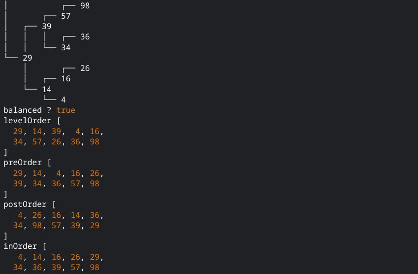
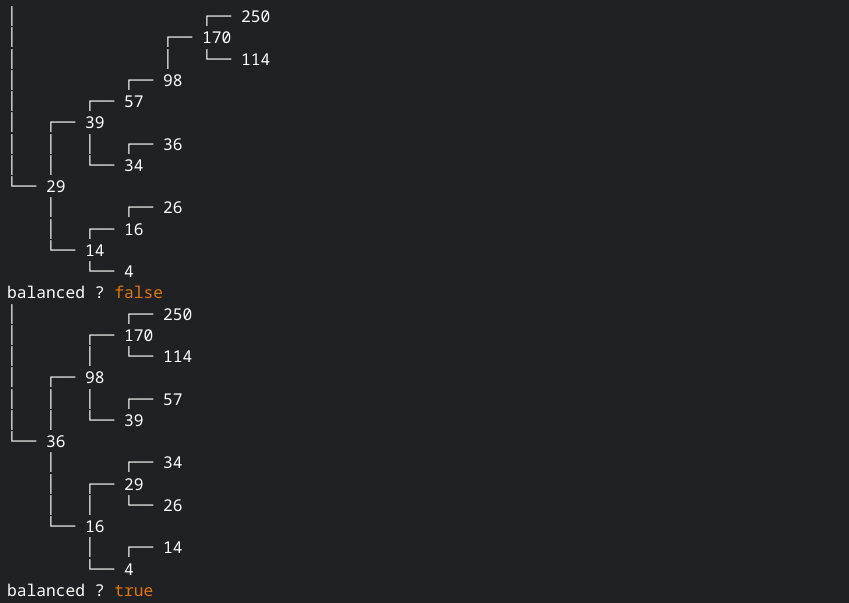
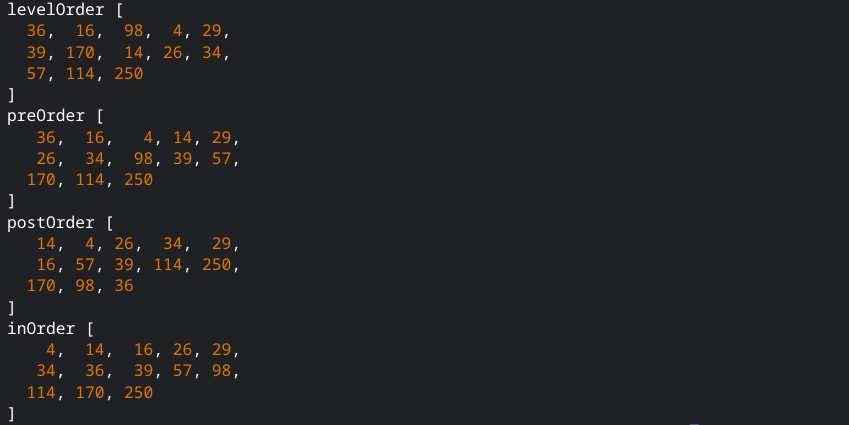

# Odin Project Binary Search Trees

[Odin Project](https://www.theodinproject.com/lessons/javascript-binary-search-trees)

## Table of Contents

- [Screenshots](#screenshots)
- [How to use](#how-to-use)
- [Thoughts](#thoughts)
- [Useful Resources](#useful-resources)

## Screenshots 







## How To Use

To clone and run this application, you'll need [Git](https://git-scm.com) and [Node.js](https://nodejs.org/en/download/) (which comes with [npm](http://npmjs.com)) installed on your computer. From your command line:

```bash
# Clone this repository
$ git clone https://jdegand.github.io/odin-project-binary-search-trees

# Change into the directory
$ cd odin-project-binary-search-trees

# Run the script
$ node bst
```

## Thoughts

- Started by making tree root always null - changed much later to having a random array turned into a balanced bst set as root
- Had to compare and contrast code with other people's code a lot
- Watched various leet code demonstrations of binary search tree problems as well 
- Binary search trees are harder to conceptualize mentally without pen and paper - never quite sure it is working correctly
- While working on this, odin project directions were updated with a prettyPrint function that really helped visualize what is going on

## Useful Resources 

- [Github](https://github.com/rafetbasturk/odin-binarySearchTrees) - bst implementation from rafetbasturk
- [Github](https://github.com/Roxanoel/binary-search-trees) - bst implementation from roxanoel
- [Geeks for Geeks](https://www.geeksforgeeks.org/how-to-determine-if-a-binary-tree-is-balanced/) - determine if a binary tree is balanced
- [YouTube](https://www.youtube.com/watch?v=-z4g2qW-d3M) - balance a binary search tree
- [YouTube](https://www.youtube.com/watch?v=i1m-rywzw68) - validate binary search tree
- [Stack Overflow](https://stackoverflow.com/questions/5836833/create-an-array-with-random-values) - create an array with random values